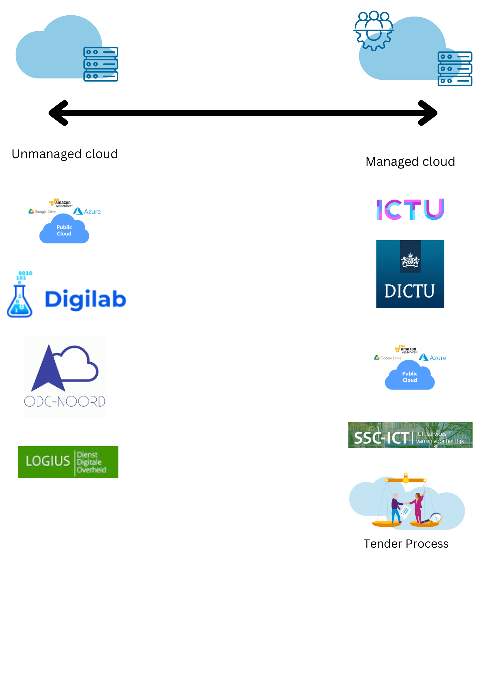

# ADR-0016 Government Cloud Comparison

## Context

Right now we have a few organizations (Logius, SSC-ICT, Standaard Platform, ODC-Noord, Tender process, and
Digilab, etc...) offering IT infrastructure. This ADR will give an overview of what these different organizations are
offering as well as make a decision for the AI Validation team on which infrastructure provider we will focus.

## Descriptions and comparison

- [SSC-ICT](https://www.ssc-ict.nl/)
    - Description:
        - SSC-ICT is an ICT service provider for some ministries of the government of the Netherlands. In the
  [service catalogue of 2024](https://redactie.rijksportaal.overheid-i.nl/site/binaries/content/assets/rijksportaal/organizations/bzk/pdf/dg-vbr-directoraat-generaal-vastgoed-en-bedrijfsvoering-rijk/ssc-ict/inhoud/ssc-ict-producten--en-dienstencatalogus-2024.pdf)
  no mention of Kubernetes is in the document. They are specialized in workplace management but through an
  NSK(not standard client request) extra services could be provided by them.
    - Pros:
        - The integration with the RON (Rijksoverheid Network) is managed well because that is a service that SSC-ICT
also manages.
    - Cons:
        - They are known to be very bureaucratic, a standard NSK can take up at least half a year and then still you
don't have what you want.
- [Standaard Platform (Logius)](https://www.logius.nl/domeinen/infrastructuur/standaard-platform)
    - Description:
        - The standard Platform of Logius will provide an Openshift Kubernetes namespace for you
    - Pros:
    - Cons:
- [ODC-Noord](https://www.odc-noord.nl/)
    - Description:
        - ODC-Noord provides multiple services, on one hand it can provide:
                - [Platform as a Service](https://www.odc-noord.nl/platform-service/), with this service you can set-up
Virtual machines with specific open source software packages. However, this is not a scalable service, as you are
limited to quotas you have on a project and limits of the virtual instance.
                - Another service is [Infrastructure as a Service](https://www.odc-noord.nl/infrastructure-service-iaas/),
here you can set-up anything you want on Openshift.
                - There are several specialized services on ODC-Noord as well for
[development street](https://www.odc-noord.nl/quattro/) or [data science](https://www.odc-noord.nl/platform-service/)
but these are not suitable for hosting a custom application.
    - Pros:
        - It is another governmental party which makes communication and commitment easier.
    - Cons:
        - ODC-Noord stated that they will not invest in GPUs, which would limit our Machine Learning Jobs potential.
        - The Platform as a Service is less scalable then we would like to see.
- [Digilab](https://digilab.overheid.nl/)
    - Description:
        - Digilab will provide an Openshift Kubernetes namespace for you, but also managed services like Mattermost.
    - Pros:
        - The platform is made such based on the vision of [Common Ground](https://commonground.nl/), and thus to
standardize cloud hosting through [Haven](https://digilab.overheid.nl/projecten/haven/) for all Dutch
municipalities. This standardization improves on integration later on.
    - Cons:
- Tender Process [Aanbestedingswet](https://wetten.overheid.nl/BWBR0032203/2022-03-02)
    - Description:
        - If you don't want to make use of the governmental parties stated above you could go to the free market to
provide infrastructure for you. As the government cannot simply find a party to implement this for them, you need to
go through a tender process as described in the law stated above in the title.
    - Pros:
        - The process of acquiring this is open and transparent for everybody.
    - Cons:
        - Takes a while as generally just like with SSC-ICT you need to write a whole set of documents to specify what you
exactly want and you cannot change this in the meantime.
- [SLM Rijk](https://www.rijksoverheid.nl/documenten/publicaties/2018/11/12/strategisch-leveranciersmanagement-microsoft-rijk-slm-microsoft)
    - Description:
        - The Rijksoverheid has made Strategic Delivery Agreement that with certain restrictions public cloud providers
can be used by the Dutch Government.
    - Pros:
        - It is very easy to set-up infrastructure with the big international cloud providers.
    - Cons:
        - With our team we decided that we prefer open source solutions.
[principles.md](..%2Fway-of-working%2Fprinciples.md). So if we use some managed solutions of the big cloud providers
we would not be following our principles.
- [DICTU](https://www.dictu.nl/)
    - Description:
        - DICTU is a governmental party which can will develop custom managed solutions on their own cloud, DICTU is
part of the Ministry of Economic Affairs but is also available for other ministries. It is rumoured that just like
other parties it could provide just some Kubernetes namespaces for you.
    - Pros:
        - They have an impressive track record and can deliver production ict services well.
    - Cons:
        - You need to do stakeholder management if you make use of their services instead of changing the
infrastructure yourself.
- [ICTU](https://www.ictu.nl/#)
    - Description:
        - ICTU is like DICTU also a governmental party, but then exists by law instead of under a ministry.
    - Pros:
        - They have an impressive track record and can deliver production ict services well.
    - Cons:
        - You need to do stakeholder management if you make use of their services instead of changing the
infrastructure yourself.

Please see the following [picture](Cloud providers) for an overview of the providers in relation to what they can
provide, currently we are heavily searching in the realm of unmanaged infrastructure, as we want this to manage
ourselves.

## Decision

For our infrastructure provider we decided to go with Digilab as the main source, as they can provide us with a
Kubernetes namespace and are a reliable and convenient partner as we work closely with them.

## Risks

Certain choices are made for us if we make use of the Kubernetes namespace of Digilab, for example that we need to make
use of Flux for our CI/CD pipeline.

## Extra information

- Standaard Platform
    - [Internal Document](https://rijksportaal.overheid-i.nl/onderwerpen/kaders/artikelen/rijksbreed-bedrijfsvoeringsbeleid/ict-beleid-en-informatiehuishouding/klant-aan-het-woord-standaard-platform.html)
